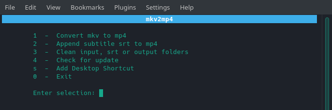

# mkv2mp4

A simple bash script to convert mkv to mp4 container in seconds
with the option to append subtitle srt files.
This project uses the powerful [ffmpeg](https://johnvansickle.com/ffmpeg/) tool.

Tested on ubuntu 16.04

## Usage
Allows conversion of one or multiple mkv files at once.

1. Place mkv files in the **input** folder
2. Optional - place srt in the **srt** folder
3. Then execute the script as follows in terminal: `./xx`
4. Your mp4 converted files will be in the **output** folder

### Project Page
https://intechgeek.com/mkv-to-mp4/
